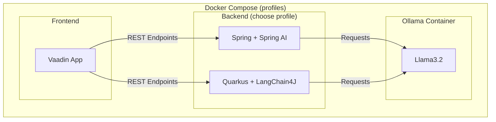

# Spring vs. Quarkus

## Spring
Start framework:
```
docker compose --profile spring up
```
## Quarkus
Start framework:
```
docker compose --profile quarkus up
```

## Frontend

After starting up the frontend is available at [http://localhost:8081](http://localhost:8081).

## Architecture 

