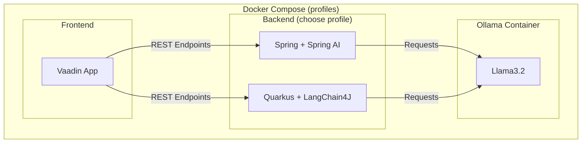

# Spring vs. Quarkus

Watch the full explanation on [Youtube](https://www.youtube.com/live/rBxcwi_t_LE?si=167bLCVYlCdmZRQy).

## Spring
Start framework:
```
docker compose --profile spring up
```
## Quarkus
Start framework:
```
docker compose --profile quarkus up
```

## Frontend

After starting up the frontend is available at [http://localhost:8081](http://localhost:8081).

## Architecture 


```mermaid
flowchart TD
    subgraph DockerCompose["Docker Compose (profiles)"]
        subgraph Frontend["Frontend"]
            Vaadin["Vaadin App"]
        end

        subgraph Backend["Backend (choose profile)"]
            Spring["Spring + Spring AI"]
            Quarkus["Quarkus + LangChain4J"]
        end

        subgraph Ollama["Ollama Container"]
            Llama["Llama3.2"]
        end
    end

    %% Connections
    Vaadin -->|REST Endpoints| Spring
    Vaadin -->|REST Endpoints| Quarkus

    Spring -->|Requests| Llama
    Quarkus -->|Requests| Llama
```
